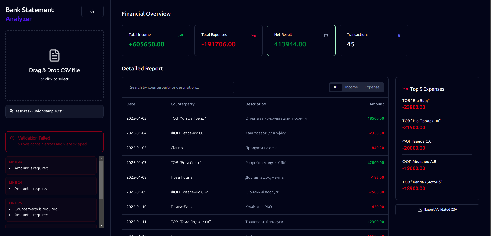

# Bank Statement Analyzer

The project is a tool for analyzing bank statements.

## How to get started

**1. Install the dependencies:**

```bash
npm install
```

**2. Start the development server:**

```bash
npm run dev
```

**3. Open [http://localhost:3000](http://localhost:3000) in your browser.**

## Main Dashboard with parsed transaction data

